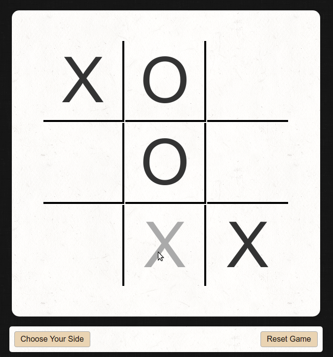
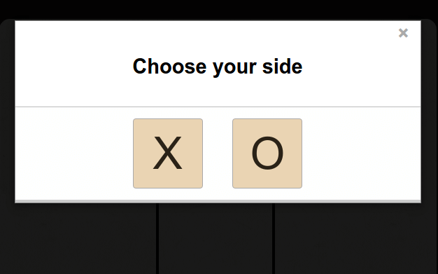

# Unbeatable Tic-Tac-Toe

## Description

This is an implementation of the [Tic-Tac-Toe](https://en.wikipedia.org/wiki/Tic-tac-toe) game where a player competes with the AI to take turns marking spaces on a 3x3 grid. The goal is to place three of their marks in a row; either horizontally, vertically or diagonally.

The game is unbeatable because the AI employs [Minimax]("https://en.wikipedia.org/wiki/Minimax"), a recursive algorithm which calculates the best move possible in a two player game with perfect information (i.e. Chess, Checkers, Tic-Tac-Toe, etc). As a result the AI cannot be beaten and it is impossible for the player to win, at best only draw. Additionally, the implementation of the Minimax algorithm also incorporates [Alpha-Beta pruning]("https://en.wikipedia.org/wiki/Alpha–beta_pruning"), which is an additional optimziation used to cut down the number of paths the AI travels and nodes visited to find the best move. As a result the recursive function calls are reduced significantly without losing accuracy in finding the solution:
   
	 
| Who starts? | # of recursive calls | +&alpha;-&beta; Pruning |
| --- | --- | --- |
| Opponent (9 possible moves) | ~550k | ~26k ( >95% reduction) |
| Player (Opp has 8 possible moves) | ~60k | ~5.2k ( >90% reduction) |

## Live Demo

https://coymeetsworld.github.io/unbeatable-tic-tac-toe/

	

## Instructions

To start a game, the user must first select if they would like to be Xs (first player to act) or Os (second player to act). The AI will assume the unchosen mark.

	

The user and AI will take turns placing their marks on the board in an attempt to connect 3 marks in a row together to win the game. If the AI wins the game will immediately end indicating the AI won. If all squares have a mark and the AI does not have 3 marks in a row, the game will end with a draw. The user cannot win in this game, so there is no use case to consider here.

## About

Unbeatable Tic-Tac-Toe was written by Coy Sanders as a requirement in the [Advanced Front-End Development Projects](https://www.freecodecamp.com/challenges/build-a-tic-tac-toe-game) for [FreeCodeCamp](http://www.freecodecamp.com) to earn the Front-End Development Certification.

software is licensed under the 

Copyright (c) 2017 

## Other Credits

Adam Sandler and Robert Downey Jr. are talented and funny actors :p
